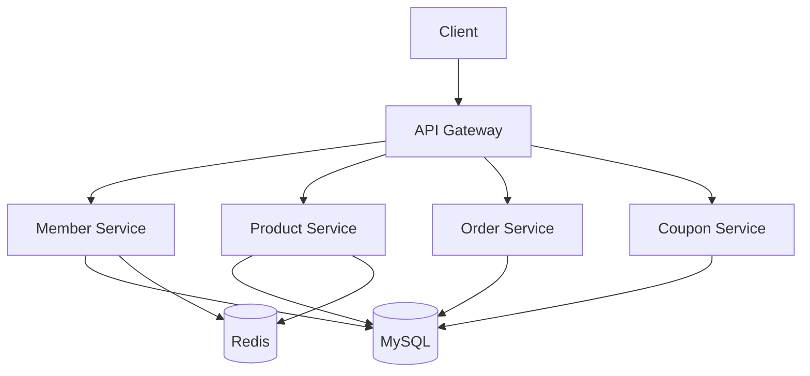

# Jjan9-Shrine

# 짱구신사 (JjangGu Shop) 🛍️

## 📝 프로젝트 소개

`짱구신사`는 안정적이고 확장 가능한 이커머스 플랫폼을 목표로 개발된 쇼핑몰 프로젝트입니다. MSA 아키텍처를 기반으로 회원, 상품, 주문, 쿠폰 등 쇼핑몰의 핵심 도메인을 구현했습니다.

## 🌟 주요 기능

### 👥 회원/인증 시스템 (Member & Authentication)
- **회원 관리**
  - 일반 회원/판매자 회원 CRUD
  - JWT 기반 인증/인가
  - 스토어 CRUD
- **소셜 로그인**
  - OAuth2.0 기반 소셜 로그인 구현
  - 네이버 로그인 지원

### 🛍️ 상품 관리 & 캐싱 (Product & Caching)
- **상품 시스템**
  - 상품 CRUD
  - 상품 검색 (Elasticsearch)
  - 필터링/정렬
- **캐싱 시스템**
  - 상품 실시간검색어

### 🛒 주문/결제 시스템 (Order & Payment)
- **장바구니**
  - Redis 기반 장바구니 CRUD
  - 재고 동시성 제어
- **주문/결제**
  - 주문/주문 취소

### 🎫 쿠폰 & 인프라 (Coupon & Infrastructure)
- **쿠폰 시스템**
  - 쿠폰 발급/사용
  - 동시성 제어
- **CI/CD**
  - GitHub Actions
  - AWS CodeDeploy

## 🛠 기술 스택

### Backend


### Database


### Infrastructure


## 📊 시스템 아키텍처



## 📋 ERD
[ERD.md](doc%2FERD.md)


## 🚀 성능 개선

### 1. 캐싱 전략
- **적용 포인트**
  - 상품 조회 (로컬 캐시)
  - 실시간 검색어 (Redis Sorted Set)
  - 장바구니 (Redis Hash)

### 2. 동시성 제어
- **분산적 락 (Optimistic Lock)**
  - 쿠폰 수량 관리
    
- **비관적 락 (Pessimistic Lock)**
  - 쿠폰 수량 관리
  - 주문 생성 시 재고 차감관리
  - 주문 취소 시 재고 증가관리
  - 주문 생성 및 취소 시 쿠폰 사용 여부 비관적 락 관리


## 🔍 트러블슈팅
@yeana - 

@hayoung -

@donggeon -

@jeongwoo -

## 📝 API 문서
| API           | 명세서 |
|---------------|-----|
| AuthAPI       | [AUTH.md](doc%2FAUTH.md)    |
| UserAPI       | [USER.md](doc%2FUSER.md)    |
| StoreAPI      | [STORE.md](doc%2FSTORE.md)    |
| ProductAPI    | [PRODUCT.md](doc%2FPRODUCT.md)   |
| CartAPI       | [CART.md](doc%2FCART.md)    |
| AddressAPI    | [ADDRESS.md](doc%2FADDRESS.md)   | 
| OrderAPI      | [ORDER.md](doc%2FORDER.md)    | 
| CouponAPI     | [COUPON.md](doc%2FCOUPON.md)    | 
| UserCouponAPI | [USERCOUPOIN.md](doc%2FUSERCOUPOIN.md)    | 


## 👨‍👩‍👧‍👦 팀원 소개

| 이름 | 담당 | GitHub |
|------|------|--------|
| 고예나 | 회원/인증 | [@yeana]([GitHub 링크](https://github.com/goo3oo?tab=repositories)) |
| 이하영 | 상품/캐싱 | [@hayoung]([GitHub 링크](https://github.com/duol9)) |
| 이동건 | 주문 | [@donggeon]([GitHub 링크](https://github.com/LeeDong-gun)) |
| 이정우 | 쿠폰/인프라 | [@jeongwoo]([GitHub 링크](https://github.com/wldnr1208)) |

## 🏃‍♂️ 시작하기

```bash
# 레포지토리 클론
git clone https://github.com/your-repository/jjanggu-shop.git

# 디렉토리 이동
cd jjanggu-shop

# 필요한 패키지 설치
./gradlew build

# 애플리케이션 실행
./gradlew bootRun
```

---
